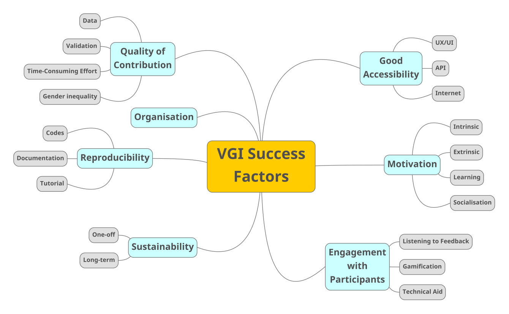

## Why are we investigating?
We all know that crowdsourcing is a powerful tool for geospatial mapping, particularly for areas that have slow administrative data updates. In the geographical context, crowdsourcing is also termed as Volunteer Geographic Information (VGI). Once the project is initiated, participants who agree with the aim of the project gather around to give help by investing their time and effort.

However, not all VGI project turn out to be successful. We discovered there are various reasons that one project can succeed or fail and these are subject to the aim and the structure of the project. We thought that it is good, as a starting point, to brainstorm many ideas and list them into a structure. Here, we list 7 elements that lead to a successful VGI project (See an overview in the figure below).

1. [Organisation](#organisation)
2. [Quality of Contribution](#quality-of-contribution)
3. [Good Accessibility](#good-accessibility)
4. [Motivation](#motivation)
5. [Reproducibility](#reproducibility)
6. [Engagement with Participants](#engaging-with-participants)
7. [Sustainability](#sustainability)





## 1. Organisation
[back to the top](#why-are-we-investigating)

* Good vision
* Define desired results
* [Promise to share the analytics and outcomes](https://www.mendeley.com/reference-manager/reader/42d7ccf4-cdfe-3521-8585-8ec1a0444033/5b34c418-3e33-91b1-78a0-be4bc60d5618/)
* Government agencies are responsible for providing authoritative data while also integrating public input, making accuracy and reliability areas of concern


## 2. Quality of Contribution
[back to the top](#why-are-we-investigating)

### 2.1. Data Quality
* Data Quality (Basiri et al., 2019): Having a better understanding of the quality of VGI may help the adoption of crowdsourced geospatial data in some projects as the perception of unreliability may impede the adoption.
* Geometric Accuracy (Gardner and Mooney 2018, AGILE conference)
* Positional inaccuracy and survey reliability has been problematised (	Nicolosi et al., 2020). For health data, privacy issues have been quite a problem. 
* Data Quality will vary according to the number of volunteers who work on the data and the particular knowledge of each volunteer (Haklay, 2013)
* VGTrust (Severinsen et al., 2019): measuring trust for volunteered geographic information. VGTrust = .2*(Reputation of an Author) + .7*(Spatial Trust ) + .1(Temporal Trust ). In the UK, OSM has nearly reached the accuracy and completeness 


### 2.2. New Ideas
* Co-creation in huge quantities may lead to a lot of new ideas (social media, photo-sharing platforms, wiki projects, etc.)
* This is called Collective Intelligence (Capineri, 2016) or Distributed Intelligence (Haklay, 2013)
* Competitions clearly links with new ideas (rewards, vouchers, and certificates)


### 2.3. Gender (In)Equality
* Gender equality is imperative to get balanced information from the crowd
* However, gender inequalities (bias) has been an issue since crowdsourcing ever happened because most active contributors need enough knowledge and time to get involved 
* A survey questionnaire asked people in the OSM mailing list to answer possible barriers for OSM contribution (Gardner et al., 2020). Is was not surprising to see a gender inequality from the active contributors where 96% of 215 participants were male. - **‘Digital divides’**.
* Nicolosi et al. (2020): Digital inequality from the internet usage. Male are predominantly contributing data. While less difference is noticed between urban (83%) and suburban areas (78%), a huge contrast of participation has been noticed between high and low incomed countries.
* Haklay (2013): Citizen science is a serious leisure activity and most likely participants will join with some existing interest in the subject and keen to learn more. Male, well educated, and from high brackets of income scale. Thus, we expect to observe participation inequality with some participants contributing a lot while many others contribute a little.

### 2.4. Personal Issues
* Privacy
* Exclusion of Minority Groups

### 2.5. Perfect Teamwork
* The procedure of throwing events to might be tiring
* Teamwork can help


## 3. Good Accessibility
[back to the top](#why-are-we-investigating)

### 3.1. Internet (APIs and Web sockets) 

### 3.2. User Experience (UX) & User Interface (UI)
* Participants first get involved of the project when they feel they agree with the aim and the directions. But what moves them to get their ‘hands-on’ work is a good-looking and easy-to-use platform. When people visit the online platform, they meet the landing page, and this will their first impression. Even if the project vision is stated clear, with all the length words meshed in the front page will distract a human eye, which can result in less participants. 
* In the world of Design & Communication, User Experience (UX) and User Interface (UI) are the most familiar terms that deal with good access. UX and UI always come together as a bundle, but there is a clear difference. UX encompasses all the experience a person encounters with a product or service. This includes creating a storyboard, testing scenarios, prototyping the preliminary model, and designing the architecture of the interface. UI is the final product that appears on the screen. The graphical design, colour combination, layouts, and typography are the factors that the users will first encounter.
* [**ThemeRise**](https://link.springer.com/article/10.1186/s40965-018-0049-4)
    * Pinheiro and Davis (2018) developed a VGI platform ThemeRise that aimed to collect noise pollution in a Brazilian city, Belo Horizonte. 
    * On the landing page shows a map of the whole city based on the openstreetmap data, then the individual was asked to pin down the location and input the noise source (e.g. air conditioning, traffic) and the surrounding environment (e.g. near road) in the attribute section. 
    * GPS signals were presumed to have helped the users find the location, but I couldn’t find anywhere that mentioned this (http://aqui.io/strepitus/). From my own experience, this platform only allows users to contribute the data but not being able to see the contribution. 
    * Additionally, we can only see a density map of noise pollution but not able to see the meatadata. Worse fact is that despite the project aimed to keep this platform for a longer-term goal, the lack of contribution has caused an ephemeral event, which they pointed out for the rationale of their study. 

## 4. Motivation
[back to the top](#why-are-we-investigating)

### 4.1. Intrinsic
### 4.2. Extrinsic
### 4.3. Learning
### 4.4. Socialisation
### 4.5. Prosocial


## 5. Reproducibility
[back to the top](#why-are-we-investigating)

* Open source software is a prime example of collaboration amongst otherwise unrelated programmers who aim to create software that is freely accessible by anyone. 
* More importantly, the code used to create the software is also shared so that anyone can see, examine, reuse or improve it. This collaborative approach also started to grow in the geomatics domain, but, whereas in software development the purpose was to work together to create an application, here, the mentality was mostly oriented towards collaboration in order to solve a common problem.


## 6. Engaging with Participants
[back to the top](#why-are-we-investigating)

* Gamification
* Giving/Receiving Feebacks
* Technical Aid


## 7. Sustainability
[back to the top](#why-are-we-investigating)

* One-off
* long-term


## Visualising Art (Testing)


```{r, echo=F, eval=F}
# Libraries
library(igraph)
library(networkD3)

# create a dataset:
data <- read.csv("VGI Success Factors.csv", header = TRUE)


# Plot
p <- simpleNetwork(data, height="100px", width="100px",
        Source = 1,                 # column number of source
        Target = 2,                 # column number of target
        linkDistance = 50,          # distance between node. Increase this value to have more space between nodes
        charge = -900,                # numeric value indicating either the strength of the node repulsion (negative value) or attraction (positive value)
        fontSize = 20,               # size of the node names
        fontFamily = "serif",       # font og node names
        linkColour = "#666",        # colour of edges, MUST be a common colour for the whole graph
        nodeColour = "#69b3a2",     # colour of nodes, MUST be a common colour for the whole graph
        opacity = 0.9,              # opacity of nodes. 0=transparent. 1=no transparency
        zoom = T                    # Can you zoom on the figure?
        )


p

htmlwidgets::onRender(p, 'document.getElementsByTagName("svg")[0].setAttribute("viewBox", "")')

```
