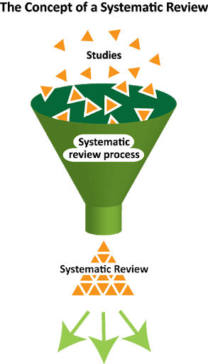

# Why do we need programming for a SLR?

---
1. ~~Build a scope~~
2. ~~Formulate a research question~~

---

3. **Identify key concepts**
4. **Develop search terms/booleans**
5. **Establish inclusion criteria**
6. **Search fields and Limits**

---
7. Monitor the result
8. Iterate 1-6 until an inter-rater agreement
9. Quality assessment
10. Data Extraction 
11. Synthesis with the Conceptual framework
---

A systematic literature review (SLR) is can be a tedious process as it has to reiterate the searching process many many times until all the researchers are satisfied with the final output.
The researcher must find suitable academic databases, possibly around three-five, then input a combination of keywords to get the outcomes. Ahh, yes! we need to visualise them too!

However, none of us would like to sit down all day simply staring at a spreadsheet that looks as identical as the other file that was just opened. Although each database provides its own set of visualisation tool that can be saved as a pdf of png file with a click. But, frankly speaking, can we use the figures for out review if we have to integrate results from mutiple databases? Do we have to delete the duplicates by hand?

**This is where programming kicks in.**

Programming saves a lot of time to deduplicate the papers found from different databases, cleans the data into a readable form, and visualises the outcomes in tables, maps, and network graphics.

# Candidate Packages

## Pre-processing
* [`bibliometrix`](https://bibliometrix.org/): Suitable for quantitative literature analytics. Retrieves only one database at a time as the syntax varies by the form of database outcomes. 3/5.
* [`litsearchr`](https://elizagrames.github.io/litsearchr/index.html): The litsearchr R package facilitates quick, objective, reproducible search strategy development using text-mining and keyword co-occurrence networks to identify important terms to include in a search strategy. Relys on a sister package called `synthesisr`
* [`synthesisr`](https://cran.r-project.org/web/packages/synthesisr/vignettes/synthesisr_vignette.html): synthesisr recognizes the file output of commonly used databases for systematic reviews and merges results into a standardized format. The package can import, assemble, and deduplicate results that enables the researcher to analyse the data. 
* [`sysrevdata`](https://softloud.github.io/sysrevdata/index.html): R package for converting systematic review and map databases into different formats for human- and machine- readability. Provides tidy-tables and a leaflet map

## Analysis
* [`litsearchr`](https://elizagrames.github.io/litsearchr/index.html): The litsearchr R package facilitates quick, objective, reproducible search strategy development using text-mining and keyword co-occurrence networks to identify important terms to include in a search strategy. Relys on a sister package called `synthesisr`
* [`Prisma2020`](https://estech.shinyapps.io/prisma_flowdiagram/): A shiny app that auto-creates the flow chart of the SLR procedure in png and pdf.
* [`metafor`](http://www.metafor-project.org/doku.php/plots): metafor automated reports | A function to summarize meta-analysis outputs

## Quality Assessment
* [`robvis`](https://mcguinlu.github.io/robvis/index.html): The robvis package takes the summary table from risk-of-bias assessments and produces plots formatted according to the assessment tool used.

# My Bias
* For pre-processing, I am considering to use `synthesisr` and `litsearchr`.
* For the main analysis, I will be using `litsearchr` and `metafor` for the figures, and `Prisma2020` for the flowchart.
* Finally and undoubtedly, I am expecting `robvis` to finalise the whole work with the quality assessment.
