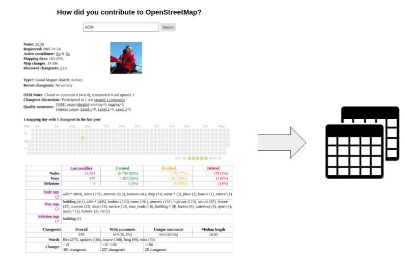

## tl;dr

* We attempted to scrape as many OSM profiles and convert it into a tabular format
* All of the data were kept under a JavaScript file.
* We scraped, cleaned and explored the data 

```{r echo=F}

```


## Intro
This blog elaborates the dataset published by Zoe Gardner (2020)'s paper [Quantifying gendered participation in OpenStreetMap: responding to theories of female (under) representation in crowdsourced mapping](https://link.springer.com/article/10.1007/s10708-019-10035-z).

Zoe has conducted a survey of OSM users to understand the likelihood contribution of under-represented groups.
She gathered 315 user's data with age, gender, nationality, country of residence, and degree.
However, the problem with her survey data is that firstly, not all of the users can be browsed from the [Name Browser](https://hdyc.neis-one.org/), and secondly, there are plenty of information in the OSM web profile that hasn't be investigated in her paper. For example:

* number of nodes, 
* number of tags
* type of tags
* number of hours spent
* weekdays/weekends of contribution.


Since our overall goal is to compare OSM contribution by demographic groups (assuming that there is a low contribution in underrepresented groups), here is a preliminary dataset that we explored. We note that all profile data are accessible as per the OSM policy. 


## Load library and fetch files
Amongst multiple ways, we use two R packages `tidyjson` to read and analyse json files, and `tidyverse` for querying and further analysis.  

```{r}
library(tidyverse)
library(tidyjson)
```

We found 30 files in the Contributors folder all ending with `json`. However, we want the files to be piled as a single file.
So we use `purrr::map()` to query multiple json files and `reduce` with `bind_rows()`. We added id just to simplify the usernames.

```{r warning=FALSE}
# this should give you a character vector, with each file name represented by an entry
filenames <- list.files("Contributors/", pattern="*.json", full.names=TRUE) 

# Import data
osm_json <-filenames %>% 
  map(read_json) %>% 
  reduce(bind_rows) %>% 
  mutate(document.id = row_number())
```

Using `class()`, we realise that this file works as a tibble (known as rectangular dataframe with columns of info), and a json. But according to the order, this recognises as a json file.
```{r}
# Check data type
class(osm_json)  
```

* We leave here a small note that we tidied our json files in order to be analysed smoothly. You can visit our [github page](https://github.com/mrsensible/VGI/tree/main/content/post/2021-05-20-gathering-osm-profiles-for-research/fileerrors.R) to see how they were cleaned.


## Glance at our dataset
With the assistance of `tidyjson` package, we can take a look at our data with `glimpse()`.
You can see that there are 30 rows (contributors) and 165 columns. The rows can increase as we gather more data. 

```{r}
osm_json %>%  
  spread_all() %>% 
  glimpse()
```

Otherwise, we can query the first hierarchy of data.

```{r warning=F}
# browse Types 
osm_json %>% 
  gather_object %>% 
  json_types %>%
  count(name, type) %>% 
  print(n = Inf)
```

You can query a few columns of your own. It seems quite messy on the JavaScript when you open it in R, but the package will help you clean them. 
```{r}
# Glance at the first index
osm_json %>% 
  enter_object('contributor') %>% 
  gather_object('index.1') %>% 
  spread_all() %>% 
  append_values_string() 


osm_json %>%
  as_tbl_json(drop.nulljson = T) %>% 
  enter_object('changesets') %>%
  spread_values(days = jstring(days)) 

```


## Convert to an R style dataframe

Those who might not want to see the JSON file automatically attached with the dataframe, we will show you how we dropped the json keys by using `as_data_frame.tbl_json()`. You can see that "tbl_df" has now become the primary data type.
```{r}
osm_json %>% 
  spread_all() %>% 
  as_data_frame.tbl_json() -> osm_tibble

class(osm_tibble)
```


## Merge the survey data


```{r message=F, warning=F}
survey_original <- readxl::read_xlsx("OSM survey data.xlsx") %>% select(-c(`(Found) Username`, ...6, `6.a. If you selected Other, please specify:`))

survey_original %>% 
  rename(username = `1. What is your OpenStreetMap Username?`,
         gender = `2. What gender do you identify as?`,
         age = `3. What is your age?`,
         country_residence = `4. What is your country of residence?`,
         nationality = `5. What is your nationality?`,
         education = `6. What is your highest level of education?`
         ) -> survey

survey %>% 
  slice(1:30) %>% 
  mutate(id = row_number()) %>% 
  select(id, gender, age) -> survey_profile

survey_profile

```


## Data Query

```{r}
survey %>% 
  left_join(osm_tibble, by = c("username" = "contributor.name")) %>% 
  select(username, gender, age, country_residence, nationality, education, 
         starts_with("contributor")) 
  

survey %>% 
  left_join(osm_tibble, by = c("username" = "contributor.name")) %>% 
  select(username, gender, age, country_residence, nationality, education, 
         starts_with("lastmodifier")) %>% 
  DT::datatable()
```


## Final Product: Days

```{r}
### Days
osm_json %>%
  as_tbl_json(drop.nulljson = T) %>% 
  enter_object('changesets') %>%
  spread_values(days = jstring(days)) %>% 
  as.data.frame() %>% 
  pull(2)-> days

data.frame(days) %>% 
  mutate(days = gsub("\\|$","", days)) %>%
  separate_rows(days, sep = "[|]") %>%
  separate(days, c("Sun", "Mon", "Tue", "Wed", "Thu", "Fri", "Sat"), ",") -> days_df

survey_profile %>% 
  bind_cols(days_df)
```


## Final Product: Hours
```{r}
### hours
osm_json %>%
  as_tbl_json(drop.nulljson = T) %>% 
  enter_object('changesets') %>%
  spread_values(hours = jstring(hours)) %>% 
  as.data.frame() %>% 
  pull(2)-> hours

data.frame(hours) %>% 
  mutate(hours = gsub("\\|$","", hours)) %>%
  separate_rows(hours, sep = "[|]") %>%
  separate(hours, c("h01", "h02", "h03", "h04", "h05", "h06",
                    "h07", "h08", "h09", "h10", "h11", "h12",
                    "h13", "h14", "h15", "h16", "h17", "h18",
                    "h19", "h20", "h21", "h22", "h23", "h24"
                    ), ",") -> hours_df

survey_profile %>% 
  bind_cols(hours_df)

```

